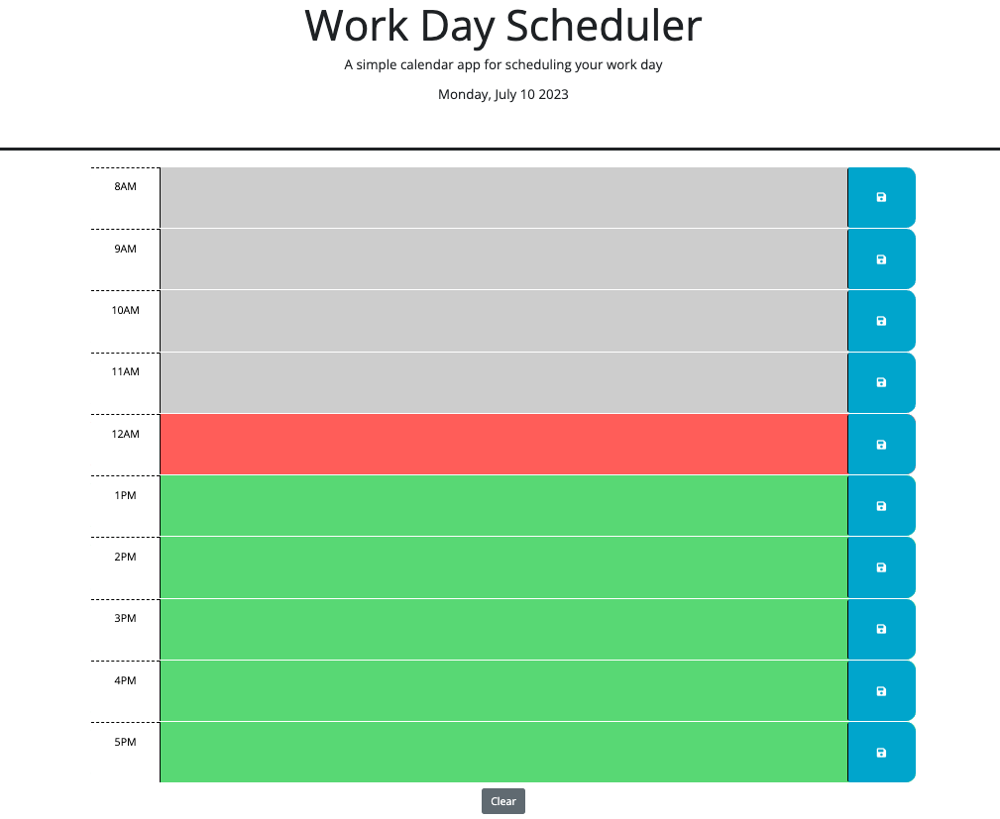

# Daily Planner

## Description

This project was created for our week 5 challenge. This looks at how to create an application using third party api's. This simple calendar application allows a user to save events for each hour of the day. This runs in the browser and features dynamically updating HTML and CSS powered by jQuery.

## Table of Contents

- [Title](#title)
- [Description](#description)
- [Installation](#installation)
- [Usage](#usage)
- [Tests](#tests)
- [Demo](#demo)
- [Contributing](#contributing)
- [Questions](#questions)

## Installation

You will need to install, VS code, Node and DayJS.

## Usage

You can view this application by opening the index.html in your browser/live server.

## Tests

You can test this application by entering text in each box, you can also ensure it saves by using the blue button on the right. You can also check that the date displayed is correct. You can also check that the red colour is showing for the correct current hour (for exmaple if it is between 11am and 12 then the bar should be red for that slot and so on).

## Demo

[Video showing functionality](https://youtu.be/SvD8-R9tFZY)

## Contributing

Faith Meades

## Questions

Username: FaithsCoding,
URL: https://github.com/FaithsCoding/daily-planner,
You can send me any questions via email: faithscoding@outlook.com
